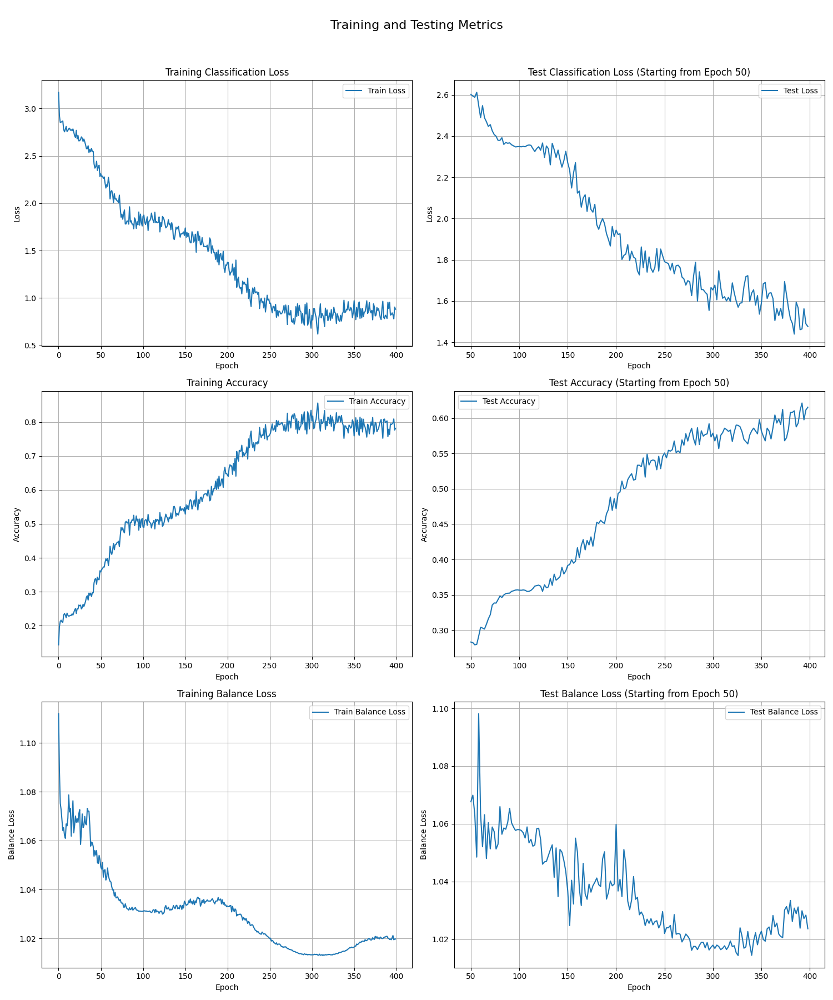
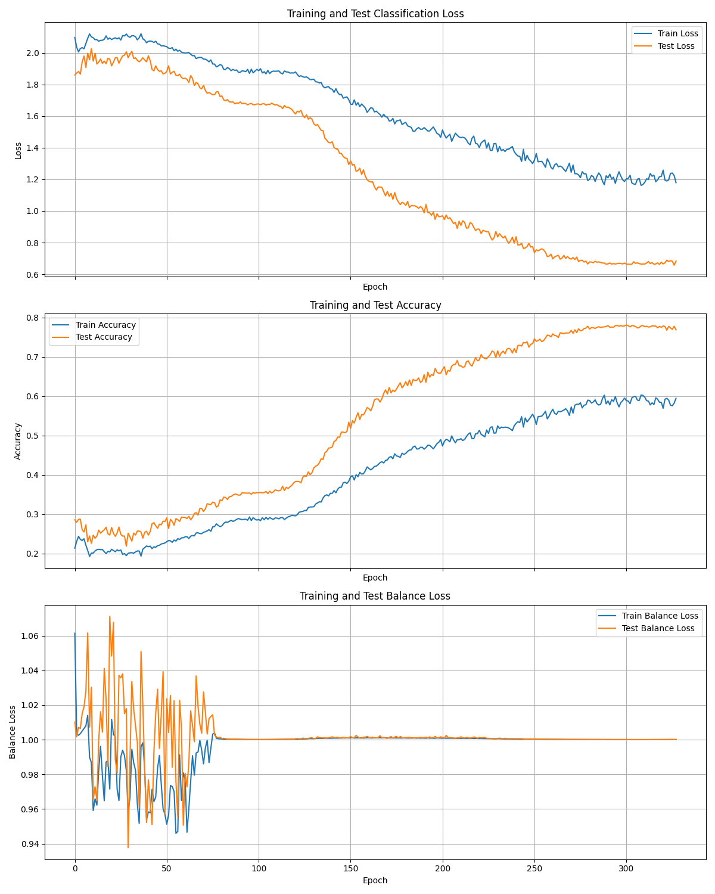
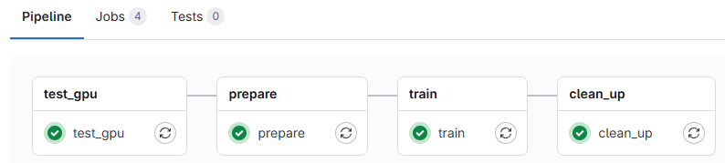

# Mixture-of-Experts_Research
Research MoE application in safety-critical system at Institute of Software Integrated System - Vanderbilt University

# To do list
 **DevOps**
- [x] Python automation test
- [x] Jenkins/GitLab pipeline
- [ ] Fine tune training params

 **Performance**
- [x] Add Stiochastic Depth
- [x] Add L2 Regularization
- [x] Add CutMix
- [x] Start testing after N epochs, once every M epochs.
- [x] Add Attention mechanism for Router improvement
- [x] Add RandAugment
- [x] Add Label Smoothing 
- [x] Add Warmup
- [ ] Gradient clipping
- [ ] Add DEBUG mode

# User Manual

 **Requirements**

- Python 3.10
- `pip install torch torchvision torchaudio --index-url https://download.pytorch.org/whl/cu121`
- `pip install tqdm matplotlib netron onnx`

 **Instruction**

- Start training: 
    `python .\src\Vision_Transformer_Pytorch\train_moe.py`
- Calculate normalization value for the dataset:
    `python .\src\Normalization_Value\gtsrb_normalization_compute.py `

# Architecture

| Criteria                                  | Value       | Note    |
|-------------------------------------------|-------------|---------|
| Number of experts:                        | 7           |         |
| Top K (number of experts active per token)| 3           |         |
| Number of embedded layers                 | 9           |         |
| Parameters                                | 18.756.846  |         |

Architecture:

# Performance with GTSRB

Full Name: German Traffic Sign Recognition Benchmark

Purpose: Traffic sign recognition for **autonomous driving** and computer vision research

Content: 50,000 images for 43 dfferent traffc sign classes, vary in size and include real-world distortions.

Reference: https://www.kaggle.com/datasets/meowmeowmeowmeowmeow/gtsrb-german-traffic-sign/data

| Criteria                  | Result    | Note                  |
|---------------------------|-----------|-----------------------|
| Best training accuracy    | 0.7764    |                       |
| **Best testing accuracy** |**0.8289** |last train:            |
| Best training loss        |           |                       |
| Best testing loss         |           |                       |
| Train balance loss        |           |                       |
| Test balance loss         |           |                       |

Download the dataset from: https://sid.erda.dk/public/archives/daaeac0d7ce1152aea9b61d9f1e19370/published-archive.html

- Training Set: GTSRB-Training_fixed.zip

- Test Images: GTSRB_Final_Test_Images.zip

- Test Annotations: GTSRB_Final_Test_GT.zip

Standard folder structure: 

    ./src/Vision_Transformer_Pytorch/data/
    └── GTSRB/
        ├── Training/
        │   ├── 00000/
        │   │   ├── 00000_00000.ppm
        │   │   ├── 00000_00001.ppm
        │   │   └── GT-00000.csv
        │   ├── 00001/
        │   │   ├── 00001_00000.ppm
        │   │   ├── 00001_00001.ppm
        │   │   └── GT-00001.csv
        │   └── ... (up to 00042)
        ├── Test/
        │   ├── Images/
        │   │   ├── 00000.ppm
        │   │   ├── 00001.ppm
        │   │   └── ...
        │   └── GT-final_test.csv

# Performance with CIFAR-10

Full Name: Canadian Institute For Advanced Research (CIFAR-10)

Purpose: Standard dataset for evaluating image classification models

Content: 60,000 32×32 color images across 10 classes. Each class has 6,000 images (5,000 training + 1,000 test).

Reference: https://www.cs.toronto.edu/~kriz/cifar.html

| Criteria                  | Result    | Note                  |
|---------------------------|-----------|-----------------------|
| Best training accuracy    | 0.7056    |                       |
| **Best testing accuracy** | **0.7821**|last train: 7e86c261   |
| Best training loss        | 0.7975    |                       |
| Best testing loss         | 0.7461    |                       |
| Train balance loss        | 1.0004    |                       |
| Test balance loss         | 1.0004    |                       |

# GitLab CI/CD DevOps Pipeline
*Why do you a CI/CD pipeline for this? -> Yes👍*

Benefit of a CI/CD pipeline is freeing up your machine from building/testing/compiling. You can make changes on your slim and light laptop, push changes to be compiled/built/test on your server or more powerful home PC and don't have to worry about lugging around a clunky and power hungry workstation. 

One method to do this is to remotely connect to your PC over the internet. This poses some security risks, since you are exposing your PC to the entire internet to find. Using GitLab Runner or Jenkins Agent is safer (knock on wood).

