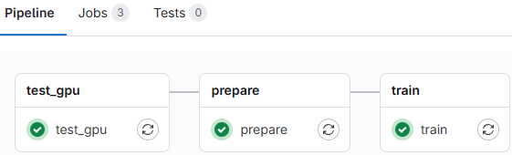

# Mixture-of-Experts_Research
Research MoE application in safety-critical system at Institute of Software Integrated System - Vanderbilt University

# To do list
 **DevOps**
- Python automation test - Done
- Jenkins/GitLab pipeline - Done
- Fine tune training params - In progress

 **Performance**
- Add Loss Balancing - In progress

# GitLab CI/CD DevOps Pipeline
*Why do you a CI/CD pipeline for this? -> Yes👍*

