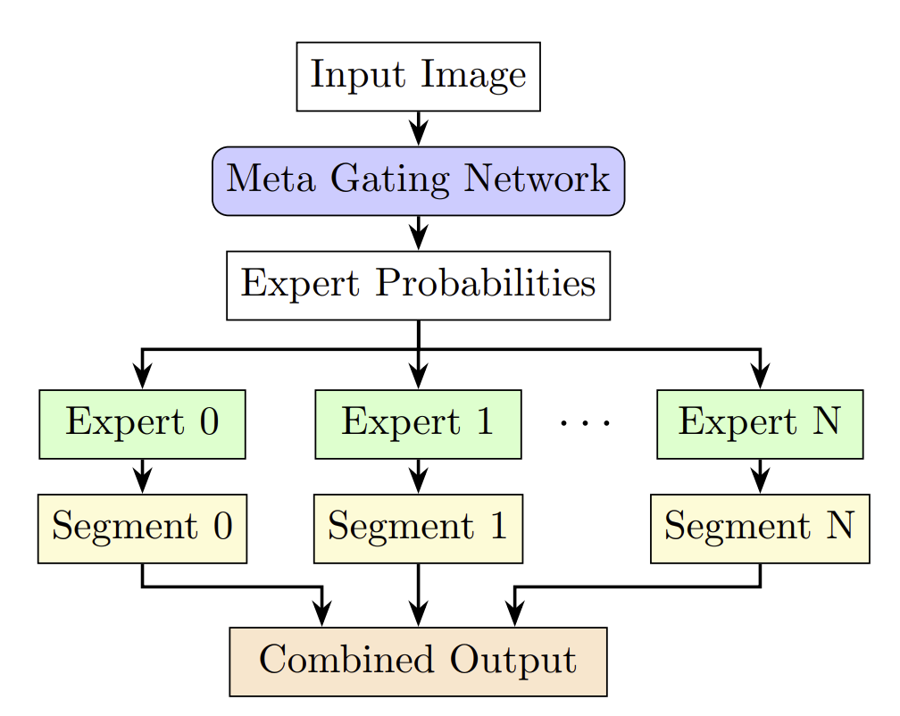
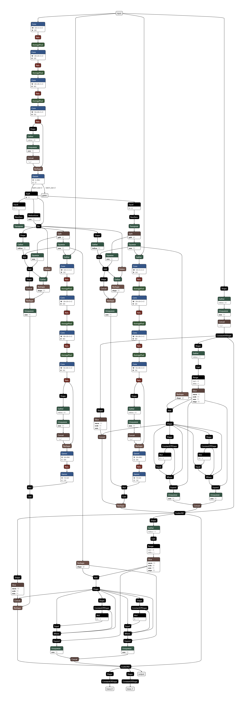
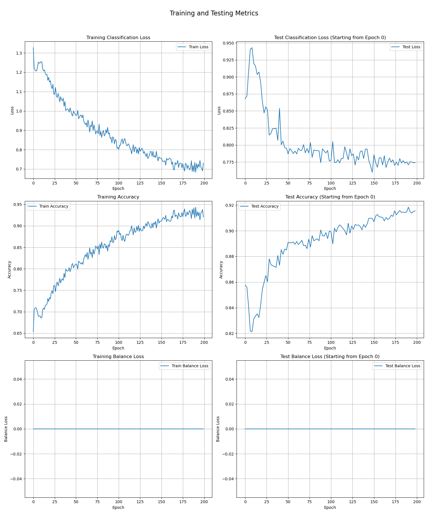
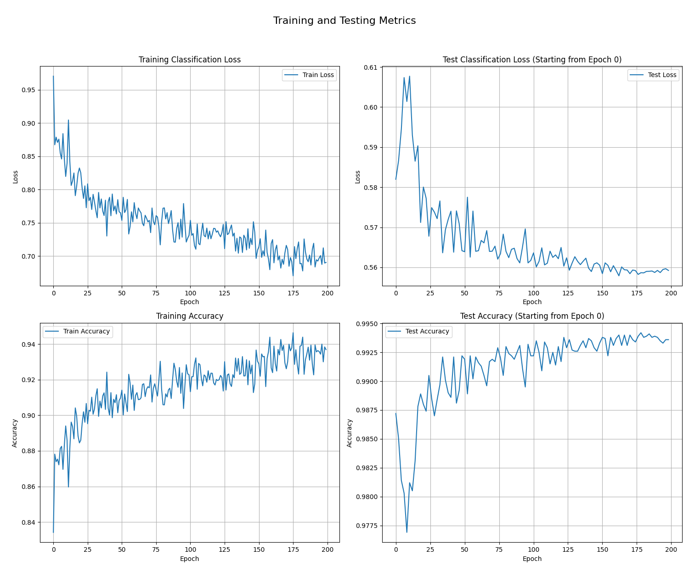
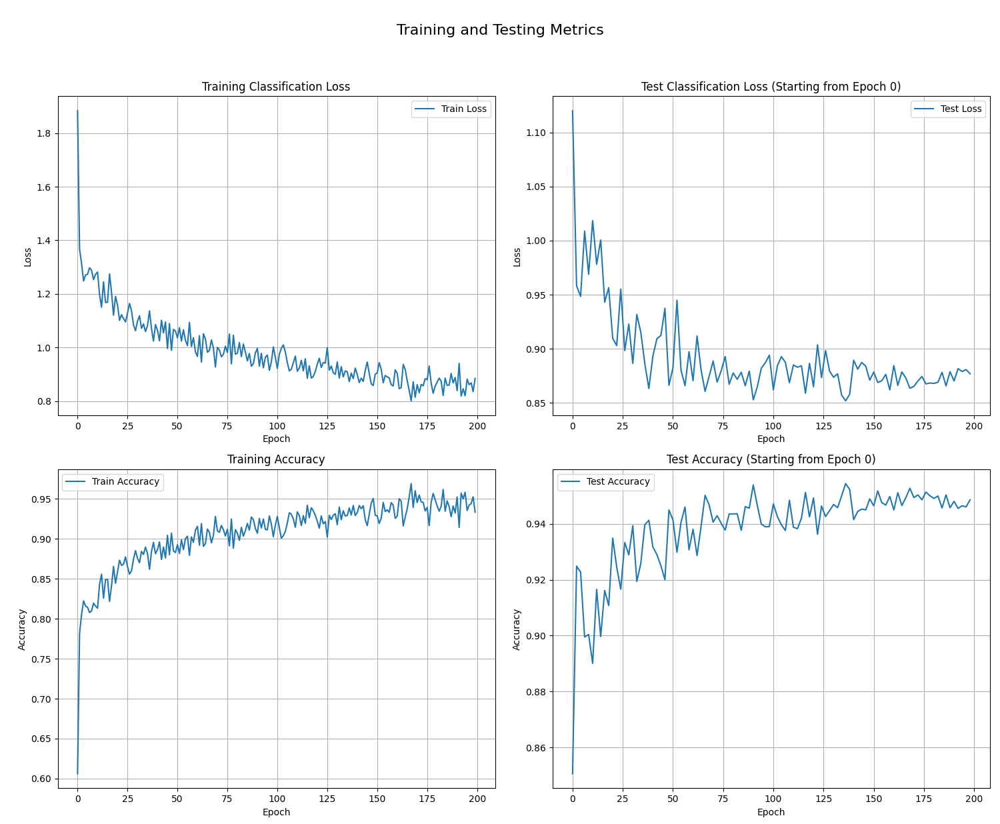
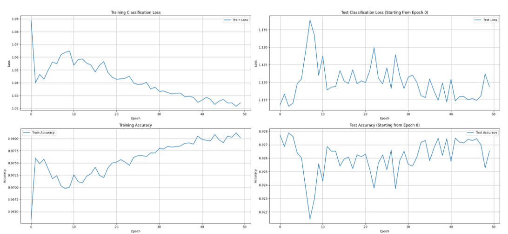
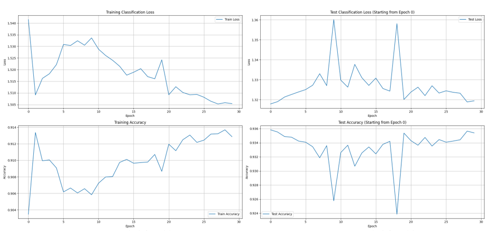
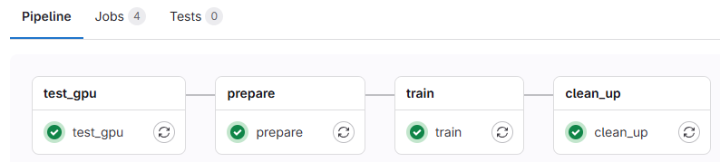

# Mixture-of-Experts_Research
Research MoE application in safety-critical system at Institute of Software Integrated System - Vanderbilt University

# To do list
 **DevOps**

 **Performance**

# User Manual

 **Requirements**

- Python 3.10
- `pip install torch torchvision torchaudio --index-url https://download.pytorch.org/whl/cu121`
- `pip install tqdm matplotlib netron onnx adversarial-robustness-toolbox timm`

- NNV and GNNV modules for robustness verification: `git submodule update --init --recursive`

 **Instruction**

- Start training: 
    `python .\train.py --dataset CIFAR10`
    `python .\train.py --dataset MNIST`
    `python .\train.py --meta_moe`
    - to see all options run `python .\train.py --help`

# Architecture

| Criteria                                  | Value       | Note    |
|-------------------------------------------|-------------|---------|
| Number of experts:                        | 2 or 3      |         |
| Top K (number of experts active per token)| 1 (sparse) or 3 (dense) | |
| Parameters                                | ~2M params  |         |

Architecture:

Block Diagram architecture:

Netron architecture with 2 Experts (open in new tab to view)

# Performance with CIFAR-10

Full Name: Canadian Institute For Advanced Research (CIFAR-10)

Purpose: Standard dataset for evaluating image classification models

Content: 60,000 32×32 color images across 10 classes. Each class has 6,000 images (5,000 training + 1,000 test).

Reference: https://www.cs.toronto.edu/~kriz/cifar.html

# Performance with MNIST

Full Name: 

Content: 

Reference: 

# Performance with GTSRB

Full Name: German Traffic Sign Recognition Benchmark

Purpose: Traffic sign recognition for **autonomous driving** and computer vision research

Content: 50,000 images for 43 dfferent traffc sign classes, vary in size and include real-world distortions.

Reference: https://www.kaggle.com/datasets/meowmeowmeowmeowmeow/gtsrb-german-traffic-sign/data

Download the dataset from: https://sid.erda.dk/public/archives/daaeac0d7ce1152aea9b61d9f1e19370/published-archive.html

- Training Set: GTSRB-Training_fixed.zip

- Test Images: GTSRB_Final_Test_Images.zip

- Test Annotations: GTSRB_Final_Test_GT.zip

# Performance with Mixture-of-Experts initial training

Initial training with 2 experts: GTSRB and CIFAR10

| Criteria                  | Result    | Note                  |
|---------------------------|-----------|-----------------------|
| Best training accuracy    |    |                       |
| **Best testing accuracy** | |                       |

# Performance with Mixture-of-Experts fine-tune training

Fine-tine the initial MoE to integrate MNIST expert

| Criteria                  | Result    | Note                  |
|---------------------------|-----------|-----------------------|
| Best training accuracy    |    |                       |
| **Best testing accuracy** | |                       |

# Formal Verification

This project includes formal verification of both the MetaMoE router and individual expert models using alpha-beta-CROWN (VNN-COMP 2021-2024 winner).

**Router Verification Results:**
- 100% verification success rate on 20 test samples (10 MNIST + 10 CIFAR10)
- Average verification time: 10.82 seconds per sample at epsilon = 2/255
- Provable guarantee: No adversarial perturbation within epsilon-ball can change expert selection

**Expert Verification:**
- Scalable to CNNs with millions of parameters
- Provides formal robustness certificates for classification

**Documentation:**
- Complete guide: [src/Formal_Neural_Network_Verification/alpha-beta-crown/FORMAL_VERIFICATION_GUIDE.md](src/Formal_Neural_Network_Verification/alpha-beta-crown/FORMAL_VERIFICATION_GUIDE.md)
- Quick reference: See [CLAUDE.md](CLAUDE.md) section on "Formal Verification with alpha-beta-CROWN"
- Note: if you have an issue with auto_LiRPA:
  - Remove: `modules/alpha-beta-CROWN/complete_verifier/auto_LiRP`

# GitLab CI/CD DevOps Pipeline
*Why do you a CI/CD pipeline for this? -> Yes👍*

